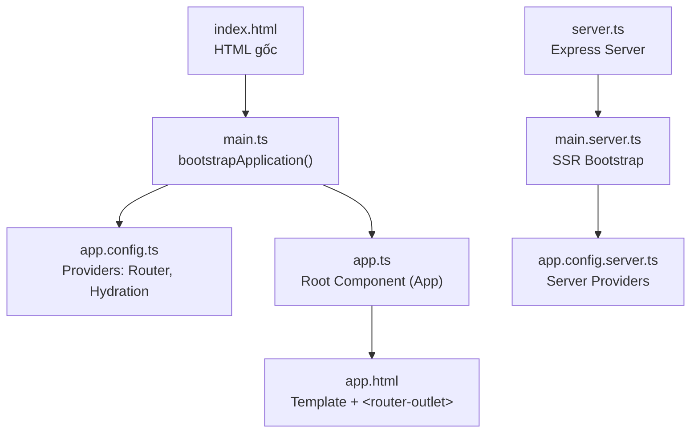
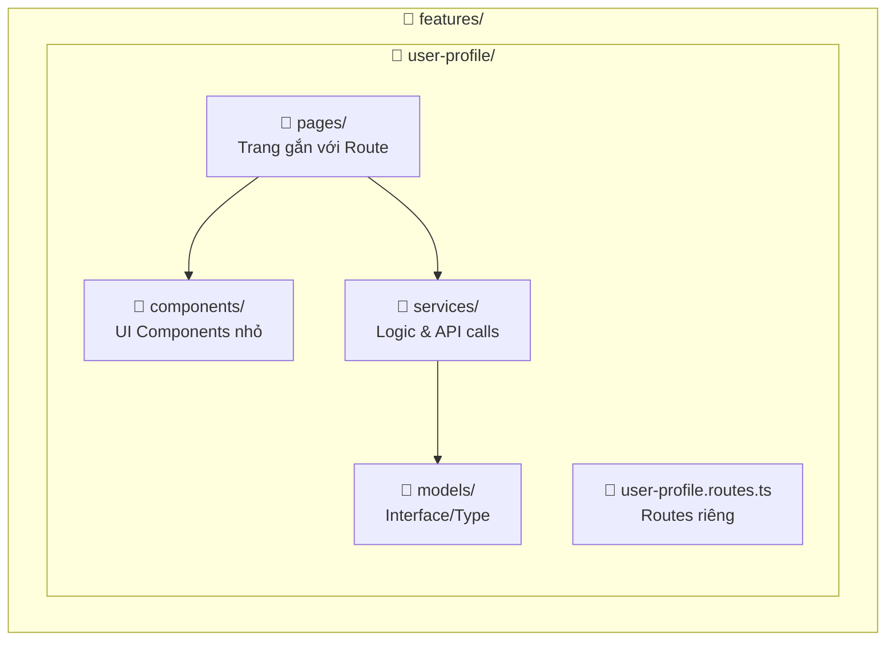
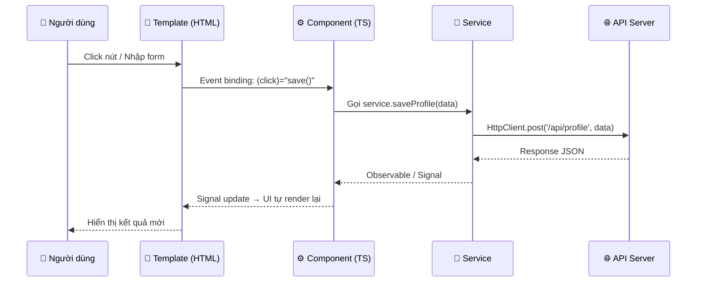

# 🔍 Phân tích Project Angular 21 — FirstProject

---

## 1. Tổng quan Project

| Thông tin | Chi tiết |
|-----------|----------|
| **Framework** | Angular 21.2.0 (mới nhất) |
| **Kiến trúc** | Standalone Components (không dùng NgModule) |
| **SSR** | Có — Server-Side Rendering với Express |
| **CSS** | TailwindCSS v4 + PostCSS |
| **Testing** | Vitest |
| **Linter/Formatter** | Prettier |

---

## 2. Cấu trúc thư mục — Sơ đồ tổng quan

```
FirstProject/
├── 📁 .angular/                    ← Cache của Angular CLI (không chỉnh sửa)
├── 📁 .vscode/                     ← Cấu hình VS Code
├── 📁 node_modules/                ← Dependencies (npm install)
├── 📁 public/                      ← Static assets (favicon, images...)
├── 📁 src/                         ← ⭐ MÃ NGUỒN CHÍNH
│   ├── 📄 index.html               ← HTML gốc (Single Page App)
│   ├── 📄 main.ts                  ← 🚀 Entry point (bootstrap ứng dụng)
│   ├── 📄 main.server.ts           ← Entry point cho SSR
│   ├── 📄 server.ts                ← Express server cho SSR
│   ├── 📄 styles.css               ← Global CSS (import TailwindCSS)
│   └── 📁 app/                     ← ⭐ TOÀN BỘ LOGIC ỨNG DỤNG
│       ├── 📄 app.ts               ← Root Component
│       ├── 📄 app.html             ← Template của Root Component
│       ├── 📄 app.css              ← CSS riêng của Root Component
│       ├── 📄 app.config.ts        ← ⚙️ Cấu hình client (providers)
│       ├── 📄 app.config.server.ts ← ⚙️ Cấu hình SSR
│       ├── 📄 app.routes.ts        ← 🛣️ Định nghĩa routing client
│       ├── 📄 app.routes.server.ts ← 🛣️ Định nghĩa routing SSR
│       ├── 📄 app.spec.ts          ← Unit test cho Root Component
│       └── 📁 features/            ← ⭐ CÁC TÍNH NĂNG (Feature-based)
│           └── 📁 user-profile/    ← Feature: Hồ sơ người dùng
│               ├── 📄 user-profile.routes.ts  ← Routes riêng của feature
│               ├── 📁 components/             ← UI components nhỏ, tái sử dụng
│               │   ├── 📁 profile-edit-form/  ← Form chỉnh sửa profile
│               │   └── 📁 profile-view/       ← Hiển thị profile
│               ├── 📁 models/                 ← Kiểu dữ liệu (interface/type)
│               │   └── 📄 profile.model.ts
│               ├── 📁 pages/                  ← Trang (gắn với route)
│               │   └── 📁 profile-page/       ← Trang profile chính
│               └── 📁 services/               ← Logic xử lý dữ liệu
│                   └── 📄 profile.service.ts
├── 📄 angular.json                 ← Cấu hình Angular CLI
├── 📄 package.json                 ← Dependencies & scripts
├── 📄 tsconfig.json                ← Cấu hình TypeScript
├── 📄 tsconfig.app.json            ← TS config cho app
└── 📄 tsconfig.spec.json           ← TS config cho tests
```

---

## 3. Giải thích chi tiết từng phần

### 3.1. Entry Points — Điểm khởi đầu



| File | Vai trò |
|------|---------|
| [main.ts](file:///d:/Angular%20Project/Study-Angular-21/FirstProject/src/main.ts) | **Khởi động ứng dụng** — gọi `bootstrapApplication(App, appConfig)` |
| [app.config.ts](file:///d:/Angular%20Project/Study-Angular-21/FirstProject/src/app/app.config.ts) | **Cấu hình providers** — Router, Client Hydration |
| [app.ts](file:///d:/Angular%20Project/Study-Angular-21/FirstProject/src/app/app.ts) | **Root Component** — Component cha của mọi thứ |
| [app.routes.ts](file:///d:/Angular%20Project/Study-Angular-21/FirstProject/src/app/app.routes.ts) | **Định nghĩa routes** — Hiện tại đang rỗng `[]` |

### 3.2. Feature-based Architecture — Kiến trúc theo tính năng

Project đang áp dụng **kiến trúc Feature-based** — đây là best practice trong Angular:



Mỗi feature folder chứa **4 thư mục con**:

| Thư mục | Vai trò | Ví dụ |
|---------|---------|-------|
| **pages/** | Trang chính (gắn route) | `profile-page` — hiển thị khi user truy cập `/profile` |
| **components/** | UI nhỏ, tái sử dụng | `profile-view` (xem), `profile-edit-form` (sửa) |
| **services/** | Logic nghiệp vụ, gọi API | `profile.service.ts` — CRUD dữ liệu profile |
| **models/** | Kiểu dữ liệu TypeScript | `profile.model.ts` — `interface UserProfile { ... }` |

### 3.3. Component anatomy — Cấu tạo 1 Component

Trong Angular 21 (Standalone), mỗi component gồm **4 file**:

```
profile-view/
├── profile-view.ts        ← Logic (TypeScript class + @Component decorator)
├── profile-view.html      ← Template (HTML + Angular syntax)
├── profile-view.css       ← Styles riêng (scoped — chỉ áp dụng cho component này)
└── profile-view.spec.ts   ← Unit tests
```

```typescript
// profile-view.ts — Ví dụ Standalone Component
import { Component } from '@angular/core';

@Component({
  selector: 'app-profile-view',      // Tên HTML tag: <app-profile-view>
  imports: [],                        // Import các component/directive khác
  templateUrl: './profile-view.html', // Link đến file template
  styleUrl: './profile-view.css',     // Link đến file CSS
})
export class ProfileView {}
```

> [!NOTE]
> Angular 21 mặc định tất cả component là **standalone** — không cần khai báo `standalone: true` nữa. Đây là một thay đổi lớn so với Angular 16 trở về trước.

---

## 4. Hướng dẫn tư duy Logic trong Angular

### 4.1. Tư duy "Cây Component" — Component Tree

Angular hoạt động theo mô hình **cây phân cấp (Component Tree)**. Khi bạn nhận một yêu cầu, hãy tư duy theo trình tự:

```
1. Yêu cầu này thuộc FEATURE nào?
   → Tạo folder trong features/

2. Feature này cần những TRANG nào?
   → Tạo pages/ — gắn với routes

3. Mỗi trang gồm những COMPONENT con nào?
   → Tạo components/ — chia nhỏ UI

4. Dữ liệu cần xử lý có KIỂU gì?
   → Tạo models/ — định nghĩa interfaces

5. Logic xử lý dữ liệu nằm ở đâu?
   → Tạo services/ — inject vào components
```

### 4.2. Luồng dữ liệu — Data Flow



### 4.3. Các khái niệm cốt lõi cần nắm

#### 🔹 Signals (Angular 21 — Cách quản lý state hiện đại)

```typescript
import { Component, signal, computed } from '@angular/core';

export class ProfileView {
  // Signal: reactive state
  name = signal('Hao Nguyen');
  age = signal(25);

  // Computed: tự động tính toán khi signal thay đổi
  greeting = computed(() => `Xin chào ${this.name()}, ${this.age()} tuổi`);

  // Cập nhật signal
  updateName(newName: string) {
    this.name.set(newName);       // set giá trị mới
    this.age.update(a => a + 1);  // update dựa trên giá trị cũ
  }
}
```

```html
<!-- Template: đọc signal bằng cách gọi hàm () -->
<h1>{{ greeting() }}</h1>
<button (click)="updateName('New Name')">Đổi tên</button>
```

#### 🔹 Services & Dependency Injection

```typescript
// profile.service.ts
import { Injectable, inject } from '@angular/core';
import { HttpClient } from '@angular/common/http';

@Injectable({ providedIn: 'root' }) // Tự động available toàn app
export class ProfileService {
  private http = inject(HttpClient); // Inject HttpClient

  getProfile(id: number) {
    return this.http.get<UserProfile>(`/api/profiles/${id}`);
  }

  saveProfile(data: UserProfile) {
    return this.http.post('/api/profiles', data);
  }
}
```

```typescript
// Sử dụng trong Component
export class ProfilePage {
  private profileService = inject(ProfileService); // Inject service
  profile = signal<UserProfile | null>(null);

  constructor() {
    this.profileService.getProfile(1).subscribe(data => {
      this.profile.set(data);
    });
  }
}
```

#### 🔹 Routing — Điều hướng giữa các trang

```typescript
// app.routes.ts — Route chính
import { Routes } from '@angular/router';

export const routes: Routes = [
  {
    path: 'profile',
    // Lazy loading: chỉ tải code khi user truy cập route này
    loadChildren: () =>
      import('./features/user-profile/user-profile.routes')
        .then(m => m.userProfileRoutes)
  },
  { path: '', redirectTo: 'profile', pathMatch: 'full' },
  { path: '**', redirectTo: 'profile' }  // Wildcard fallback
];
```

```typescript
// user-profile.routes.ts — Route con của feature
import { Routes } from '@angular/router';
import { ProfilePage } from './pages/profile-page/profile-page';

export const userProfileRoutes: Routes = [
  { path: '', component: ProfilePage }
];
```

#### 🔹 Template Syntax — Cú pháp mới Angular 21

```html
<!-- Control Flow mới (thay thế *ngIf, *ngFor) -->

<!-- IF/ELSE -->
@if (profile()) {
  <app-profile-view [profile]="profile()" />
} @else {
  <p>Đang tải...</p>
}

<!-- FOR loop -->
@for (item of items(); track item.id) {
  <div>{{ item.name }}</div>
} @empty {
  <p>Không có dữ liệu</p>
}

<!-- SWITCH -->
@switch (status()) {
  @case ('active') { <span class="green">Hoạt động</span> }
  @case ('inactive') { <span class="red">Ngừng hoạt động</span> }
  @default { <span>Không rõ</span> }
}
```

### 4.4. Mindset khi code Angular — Tóm tắt

```
┌─────────────────────────────────────────────────────────────┐
│  🧠 TƯ DUY ANGULAR = Chia nhỏ + Tái sử dụng + Reactive   │
├─────────────────────────────────────────────────────────────┤
│                                                             │
│  1. UI → Chia thành Components (page → component → child)  │
│  2. Data → Dùng Signals (reactive, tự cập nhật UI)         │
│  3. Logic → Đặt trong Services (tách biệt khỏi UI)        │
│  4. Kiểu → Định nghĩa trong Models (type safety)           │
│  5. Điều hướng → Dùng Router (lazy loading)                │
│  6. Giao tiếp → Input/Output giữa cha-con                  │
│                                                             │
└─────────────────────────────────────────────────────────────┘
```

---

## 5. Hướng dẫn tích hợp PrimeNG vào Project

### Bước 1: Cài đặt PrimeNG

```bash
npm install primeng @primeng/themes
```

### Bước 2: Cấu hình PrimeNG trong `app.config.ts`

```typescript
// src/app/app.config.ts
import { ApplicationConfig, provideBrowserGlobalErrorListeners } from '@angular/core';
import { provideRouter } from '@angular/router';
import { provideAnimationsAsync } from '@angular/platform-browser/animations/async';
import { providePrimeNG } from 'primeng/config';
import Aura from '@primeng/themes/aura';

import { routes } from './app.routes';
import { provideClientHydration, withEventReplay } from '@angular/platform-browser';

export const appConfig: ApplicationConfig = {
  providers: [
    provideBrowserGlobalErrorListeners(),
    provideRouter(routes),
    provideClientHydration(withEventReplay()),
    provideAnimationsAsync(),         // ← Animation cho PrimeNG
    providePrimeNG({                  // ← Cấu hình PrimeNG
      theme: {
        preset: Aura,                 // Theme Aura (có thể đổi: Lara, Nora...)
        options: {  
          darkModeSelector: '.dark-mode' // Optional: hỗ trợ dark mode
        }
      }
    })
  ]
};
```

### Bước 3: Import CSS PrimeNG trong `styles.css`

```css
/* src/styles.css */

/* PrimeNG icons */
@import 'primeicons/primeicons.css';

/* TailwindCSS */
@import 'tailwindcss';
```

> [!IMPORTANT]
> PrimeNG 21 không cần import theme CSS file riêng nữa — theme được cấu hình bằng code trong `app.config.ts` qua `@primeng/themes`.

### Bước 4: Cài thêm PrimeIcons (tùy chọn nhưng khuyên dùng)

```bash
npm install primeicons
```

### Bước 5: Sử dụng PrimeNG Components

Ví dụ tạo một trang profile với PrimeNG:

```typescript
// profile-page.ts
import { Component, signal } from '@angular/core';
import { Button } from 'primeng/button';
import { Card } from 'primeng/card';
import { InputText } from 'primeng/inputtext';
import { Avatar } from 'primeng/avatar';
import { Tag } from 'primeng/tag';
import { FormsModule } from '@angular/forms';

@Component({
  selector: 'app-profile-page',
  imports: [Button, Card, InputText, Avatar, Tag, FormsModule],
  templateUrl: './profile-page.html',
  styleUrl: './profile-page.css',
})
export class ProfilePage {
  name = signal('Hao Nguyen');
  email = signal('hao@example.com');
  role = signal('Developer');
}
```

```html
<!-- profile-page.html -->
<div class="profile-container">
  <p-card header="Hồ sơ cá nhân" subheader="Thông tin chi tiết">
    <div class="profile-header">
      <p-avatar icon="pi pi-user" size="xlarge" shape="circle" />
      <p-tag [value]="role()" severity="info" />
    </div>

    <div class="profile-form">
      <label for="name">Họ tên</label>
      <input pInputText id="name" [value]="name()" />

      <label for="email">Email</label>
      <input pInputText id="email" [value]="email()" />
    </div>

    <ng-template #footer>
      <p-button label="Lưu" icon="pi pi-check" />
      <p-button label="Hủy" icon="pi pi-times" severity="secondary" />
    </ng-template>
  </p-card>
</div>
```

### Bước 6: Các Theme có sẵn

| Theme | Phong cách |
|-------|-----------|
| **Aura** | Hiện đại, clean, minimal |
| **Lara** | Material-inspired, sắc nét |
| **Nora** | Enterprise, chuyên nghiệp |

```typescript
// Đổi theme — chỉ cần thay import
import Lara from '@primeng/themes/lara';  // Thay Aura bằng Lara
```

### Tổng hợp các PrimeNG Components hay dùng

| Component | Import | Mô tả |
|-----------|--------|-------|
| `<p-button>` | `Button` from `primeng/button` | Nút bấm |
| `<p-table>` | `Table` from `primeng/table` | Bảng dữ liệu |
| `<p-card>` | `Card` from `primeng/card` | Thẻ card |
| `<p-dialog>` | `Dialog` from `primeng/dialog` | Modal/Dialog |
| `<input pInputText>` | `InputText` from `primeng/inputtext` | Input text |
| `<p-dropdown>` | `Select` from `primeng/select` | Dropdown chọn |
| `<p-toast>` | `Toast` from `primeng/toast` | Thông báo |
| `<p-menubar>` | `Menubar` from `primeng/menubar` | Menu điều hướng |
| `<p-datepicker>` | `DatePicker` from `primeng/datepicker` | Chọn ngày |

> [!TIP]
> Trong PrimeNG 21 (standalone), bạn **import trực tiếp component class** chứ không import Module nữa.
> Ví dụ: `import { Button } from 'primeng/button'` thay vì `import { ButtonModule } from 'primeng/button'`.

---

## 6. Quy trình thêm Feature mới — Bước tư duy

Ví dụ: Thêm feature **"Quản lý sản phẩm" (Product Management)**

```
Bước 1: Tạo cấu trúc folder
  src/app/features/product/
  ├── product.routes.ts
  ├── components/
  │   ├── product-card/
  │   └── product-filter/
  ├── models/
  │   └── product.model.ts
  ├── pages/
  │   ├── product-list-page/
  │   └── product-detail-page/
  └── services/
      └── product.service.ts

Bước 2: Định nghĩa Model
  → interface Product { id, name, price, ... }

Bước 3: Tạo Service
  → getProducts(), getProductById(), createProduct()...

Bước 4: Tạo Components
  → ProductCard (hiển thị 1 sản phẩm)
  → ProductFilter (bộ lọc)

Bước 5: Tạo Pages
  → ProductListPage (danh sách, sử dụng ProductCard + ProductFilter)
  → ProductDetailPage (chi tiết 1 sản phẩm)

Bước 6: Định nghĩa Routes
  → product.routes.ts: { path: '', component: ProductListPage }

Bước 7: Đăng ký vào app.routes.ts
  → { path: 'products', loadChildren: () => import(...) }
```

> [!CAUTION]
> Hiện tại project có một số file đang rỗng (`profile.model.ts`, `profile.service.ts`, `user-profile.routes.ts`) và `app.routes.ts` chưa khai báo route nào. Bạn cần hoàn thiện các file này để ứng dụng hoạt động đúng.

---

## 7. Lệnh Angular CLI hữu ích

```bash
# Tạo component mới
ng generate component features/product/components/product-card

# Tạo service mới
ng generate service features/product/services/product

# Tạo interface/model
ng generate interface features/product/models/product model

# Chạy dev server
npm start

# Build production
npm run build

# Chạy tests
npm test
```
